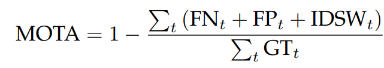

# Object Tracking Home assignment

### Установка зависимостей
```
pip install -r requirements.txt
```

### Запуск сервера
```
python .\fastapi_server.py
```

### Постановка задачи

Реализуйте методы tracker_soft и tracker_strong в скрипте fastapi_server.py,
придумайте, обоснуйте и реализуйте метод для оценки качества разработанных трекеров.
Сравните результаты tracker_soft и tracker_strong для 5, 10, 20 объектов и различных 
значений random_range и bb_skip_percent
(информацию о генерации данных читай в пункте "Тестирование"). Напишите отчёт. 
В отчете необходимо в свободном стиле привести описание методов tracker_soft, 
tracker_strong, метода оценки качества трекеров, привести сравнительную таблицу 
реализованных трекеров, сделать вывод.  
Бонусом можете выписать найденные баги в текущем проекте.

### Тестирование
Для тестирования можно воспользоваться скриптом create_track.py. Скрипт генерирует
информацию об объектах и их треках. Скопируйте вывод в новый скрипт track_n.py и
скорректируйте импорт в fastapi_server.py
```
from track_n import track_data, country_balls_amount
```
Что стоит менять в скрипте create_track.py:  
**tracks_amount**: количество объектов  
**random_range**: на сколько пикселей рамка объектов может ложно смещаться (эмуляция не идеальной детекции)  
**bb_skip_percent**: с какой вероятностью объект на фрейме может быть не найдет детектором 

### tracker_soft

- Реализация SORT(IoU)

### tracker_strong

- Готовая реализация DeepSORT

- Модификация SORT

  В матрицу расстояния, которую оптимизирует венгерский алгоритм добавляем соответствующие значения косинусного сходства эмбеддингов mobilenetv3
  Вес IOU - 0.8, cossim - 0.2

### Метрики

Multiple Object Tracking Accuracy (MOTA)



### Сравнение 

| tracks_amount      | random_range | bb_skip_percent | tracker| MOTA |
| :---:              |    :----:    |          :---:  | :---:| :---:|
| 5            | 10        | 0.25    | soft| 0.5549738219895288|
| 5            | 10        | 0.25    | strong(deepsort)| 0.5512820512820513|
| 5            | 10        | 0.25    | strong(sort+cossim)| 0.5833333333333333|
| 5            | 10        | 0.5    | soft| 0.41025641025641024|
| 5            | 10        | 0.5   | strong(deepsort)| 0.3969465648854962|
| 5            | 10        | 0.5   | strong(sort+cossim)| 0.43511450381679384|
| 10            | 10        | 0.25    |soft |0.5710594315245479 |
| 10            | 10        | 0.25    | strong(deepsort)| 0.5626911314984709|
| 10            | 10        | 0.25    | strong(sort+cossim)| 0.5718654434250765|
| 10            | 10        | 0.5    |soft |0.2365930599369085 |
| 10            | 10        | 0.5    | strong(deepsort)| 0.2645914396887159|
| 10            | 10        | 0.5    | strong(sort+cossim)| 0.311284046692607|
| 20            | 10        | 0.25    | soft|0.6030013642564802 |
| 20            | 10        | 0.25    | strong(deepsort)|0.5611745513866231 |
| 20            | 10        | 0.25    | strong(sort+cossim)|0.5938009787928222 |
| 20            | 10        | 0.5    | soft|0.29866270430906394 |
| 20            | 10        | 0.5    | strong(deepsort)|0.2884250474383302 |
| 20            | 10        | 0.5    | strong(sort+cossim)|0.29831144465290804 |

### Выводы

- Метрики strong трекеров меньше, так как при выгрузке фреймов часть из них не выгружалась и эти фреймы strong трекерам пришлось пропускать, если бы не было пропущенных фреймов, то strong трекеры показали бы себя лучше
- С ростом числа объектов растут метрики
- Реализация deepsort возвращает в качестве результата список треков, у каждого из которых есть bbox и track_id, после чего каждому объекту сопоставляется track_id трека с max iou между bbox трека и объекта, это также уменьшает метрики deepsort
- Добавление информации о сходстве изображений с помощью cossim помогло увеличить метрики, но чем больше объектов на изображении, тем менее это эффективно
- Снижение качества детекции сильно отражается на качестве трекинга, в таких случаях использование информации о сходстве изображений помогает улучшить метрики, иногда довольно значительно (10-10-05)